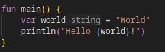
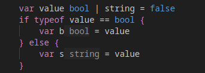
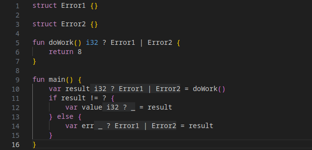
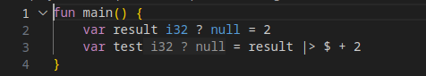
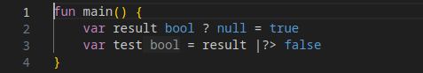
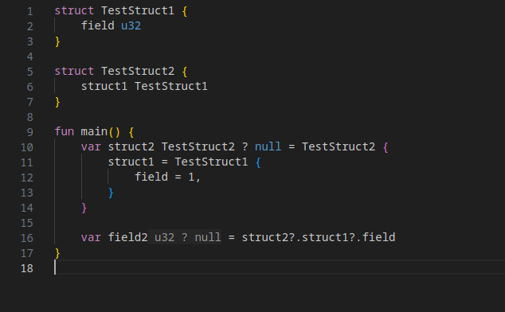
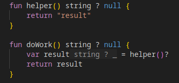

# Ceta Programming Language

Ceta is a experimental fun programming language.
Ceta aims to be a fairly small and simple language offering memory safety without garbage collection and making it easy to provide good tooling.



Feature Summary (work in progress):
- [Sum Types](#sumtypes)
- Flow analysis. Type checks automatically narrow down a sum type
- First class [`error-either`](#erroreither) types, e.g. used for nullable or result types
- [Pipe and "error pipe" operators](#pipes)
- [Optional chaining](#optionalchaining)
- [Error returns](#errorreturn)
- Structs
- Interfaces
- Generics
- IDE friendly, all semantics can be derived quickly without complex code analysis
- "Query" compiler which is also used in the [language server](#languageserver)

Planned features:
- Memory safety (borrow checker + lifetimes)
- Go like packages (and modules)
- `never` type
- Leak type (or similar)
- Virtual threads based on stack-less coroutines
- Generators
- Meta programming

## Sum Types<a id="sumtypes"></a>
A variable can have multiple types, for example, a variable can have the type `string | bool` meaning it can be a string or a boolean.

### Flow analysis and Type narrowing
A type from a sum type can be accessed using the `typeof` operator.
The information from a previous `typeof` check is preserved in the current scope.




## Error-Either Types<a id="erroreither"></a>

Ceta has a build in `error Either` type which can hold a "good" value and a "bad" error value.
The type of this Either type is written as:
`Good ? Bad`.
This can be used to describe result types are either the result value or the result error, e.g. `i32 ? Error1`.
The same mechanism can be used to describe nullable types, e.g `i32 ? null`.

The difference between an Either type and a normal sum type is that Ceta provides some special syntax to make it easier to handle them.
The state of a either types can be checked using an error check `result != ?` or `result == ?`.



## Pipes<a id="pipes"></a>
The pipe operator `|>` takes the "good" part of an expression an pipes it into a right hand side expression.
The value becomes available as a special `$` variable.



The error pipe operator `|?>` works like the normal pipe operator but takes the "bad" part of an error-either type.
This can, for example, be used to handle an error and provide a default value instead.



## Optional Chaining<a id="optionalchaining"></a>
Optional chaining works for all error either types, i.e. it works the same for nullable and error types.



## Error Return<a id="errorreturn"></a>
The `?` operator can be used to return automatically from a function in case of error case.



## Structs

## Interfaces

## Generics


## Language Server<a id="languageserver"></a>

The language server provided basic support for:
- Code completion
- Go to definition / find references
- Hover type information
- Inlay hints for inferred types

# Planned Features

Below are some features that are planned but haven't been worked on.

## Memory safety (borrow checker + lifetimes)

It planed to mostly copy Rust's borrow checker and lifetime system.
However, lifetimes will be less verbose.
For example, reference within a struct already have a default lifetime which is longer than the lifetime of the struct and which doesn't need to be specified manually.

## `never` Type

A `never` type would particularly useful for error types.
For example, you could define a generic memory allocator interface like (pseudo code):

```
fun new<Type, Error>(type Type) Box<Type> ? Error
```

With `Error = OutOfMemory` you could force the user to handle potential out of memory situation.
For `Error = never` the return type `Box<Type> ? never` is equal to `Box<Type>`, i.e. the allocator assumes there will be enough memory.

## Virtual Threads

Async-await syntax is a common feature used in language like C#, Kotlin, JS/TS or Rust and it was the original plan to use it in Ceta as well.
While Zig uses concept of "colour blind" coroutines an even more elegant idea are virtual threads as recently introduced to JVM.

For Ceta its planned to support a similar concept, i.e. sync code should be interchangeable with Rust style stack-less coroutines.
The main idea is that some code, e.g. IO interfaces, can be implement in an async and a sync method.
Important is that the interface must be the same for the sync and async case.
Similarly, locking primitives need to be provided in an sync and in an async version.

Which version of such a sync/async interface is called is determined by the compiled, i.e. if code is called within a virtual thread the async version is chosen while for normal thread the sync version is used.
This happens transparent to the user and code can seamlessly executed in a virtual thread or in a normal thread.
This requires that sync and async code have the same semantics.

Note, in Rust there are subtle differences between sync and async.
For example, while reference to a `Send + !Sync` type can be held across await points, the same reference can't be passed to another async function which can be very confusing.
One challenge is to ensure that this is not the case for Ceta.

Stack-less coroutines can't be called recursively without allocating memory.
For this reason a virtual thread would be responsible for providing a memory allocator and the compiler would automatically move function recursive calls onto the heap.
To handle potential out of memory situation the user would have to handle out of memory errors when joining a handle to a virtual thread.
However, one can also think about facilitate a virtual thread with other memory allocation strategies such as providing a preallocated thread stack.

Problem: interface or dyn lib would double in size or you need to annotate if a lib is sync/async only.

# Meta Programming

If supported, it must be IDE friendly, i.e. it must kept in reign to what it is able to do and what it does must be declared upfront.

# Build Instructions
You can't build a compiler executable right now but you can run tests and build a Ceta language server.

## Generate and test tree sitter grammar

```bash
cd lib/tree-sitter-czlang
npx tree-sitter generate
npx tree-sitter test
```

## Run tests

```bash
cargo test --package czlang --lib
```

## Compile the language server

In the `language-server` directory:

```bash
cargo build --bin server
```

## Testing the language server

Open the `vscode-extension/czlang` directory in VSCode and press `F5` to start an instance running the language server.

The server log is located in `lib/server.log`.

The language server will work for all files with `.cz` extension.

### Debugging the language server (VSCode)

Enable ptrace to attach to foreign processes:
```bash
echo 0 | sudo tee /proc/sys/kernel/yama/ptrace_scope
```

Start extension from the `vscode-extension/czlang` directory (see above).
In this root workspace start "Attach to Server" debug option and select the running language server.
